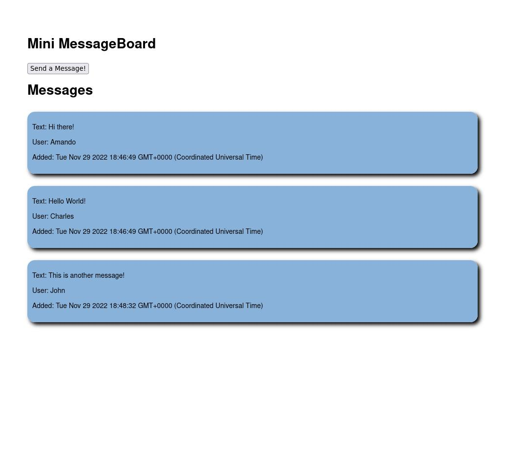

## Mini Message Board

Simple application run on server side, using NodeJs, Express and Pug as the templating language for the views.

You can have a look at the result <a href='https://mini-message-board-qm5j.onrender.com/'>here</a>
